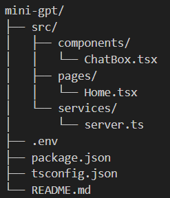
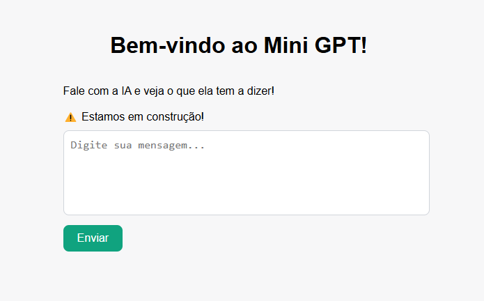

# Mini GPT 🧠💬

Projeto simples de integração entre **React** + **Express** + **OpenAI API**, criado para estudos e prática de consumo de IA via API.

## 🚀 Tecnologias usadas

- [React](https://reactjs.org/)
- [TypeScript](https://www.typescriptlang.org/)
- [Express](https://expressjs.com/)
- [OpenAI API](https://platform.openai.com/)
- [Vite](https://vitejs.dev/)

## 📂 Estrutura de pastas



## ⚙️ Como rodar o projeto

1. **Clone o repositório:**

```bash
git clone https://github.com/SEU_USUARIO/mini-gpt.git
```

2. **Instale as dependências:**

```bash
npm install
```

3. **Configure sua variável de ambiente:**

Crie um arquivo `.env` na raiz e adicione:

```
OPENAI_API_KEY=sua-chave-aqui
```

4. **Inicie o servidor (backend):**

```bash
npx tsx src/services/server.ts
```

Servidor irá rodar em: `http://localhost:5000`

5. **Inicie o frontend (React):**

```bash
npm run dev
```

Frontend irá rodar em: `http://localhost:3000`

## 🖥️ Funcionalidades

- ✅ Enviar mensagens para a IA
- ✅ Receber respostas da IA
- ✅ Interface simples e intuitiva
- ✅ Conexão segura via API Key (.env)

## 📢 Observações

- O projeto consome créditos da OpenAI, então tenha cuidado com o uso excessivo.
- Durante o desenvolvimento, foi utilizado o plano gratuito (free trial da OpenAI).

## 📸 Demonstração



## 👩‍💻 Feito por Rafaela Cutalo Moreira

## Git: https://github.com/CMRafaela

## Linkedin: https://www.linkedin.com/in/rafaelah-moreira/
